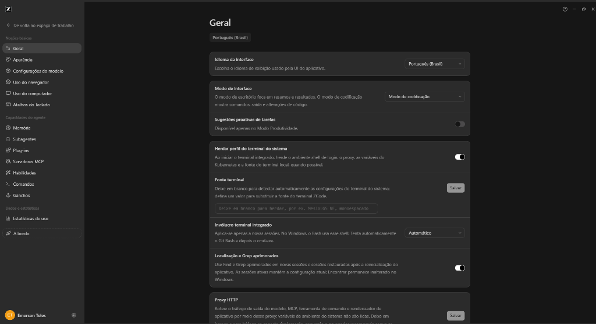

# 🤖 ZCode — Tradução para Português do Brasil (PT-BR) 🇧🇷


-green?style=for-the-badge)

Pacote portátil de localização do **ZCode** para Português do Brasil (pt-BR). O **Patcher Dinâmico Automatizado** detecta a versão instalada, preserva o número oficial e aplica a tradução usando uma base original limpa e validada da mesma versão. Atualizações futuras podem exigir ajuste se o formato ou os pontos de patch mudarem; o instalador interrompe com segurança quando não consegue validar a base.

---

## 🎥 Vídeo Tutorial & Demonstração

<p align="center">
  <a href="https://www.youtube.com/watch?v=lsZYjCf9EV4" target="_blank">
    
  </a>
</p>

---

## 📸 Demonstração Visual

<p align="center">
  
  <br>
  <em>Painel Geral, idioma da interface, modos de codificação e terminal 100% em Português do Brasil</em>
</p>

---

## 📋 Índice
1. [Sobre o Pacote](#-sobre-o-pacote)
2. [Vídeo Tutorial & Demonstração](#-vídeo-tutorial--demonstração)
3. [Demonstração Visual](#-demonstração-visual)
4. [O que Foi Traduzido](#-o-que-foi-traduzido)
5. [Destaque Tecnológico: Patcher Dinâmico](#-destaque-tecnológico-patcher-dinâmico-automatizado)
6. [Estrutura da Pasta](#-estrutura-da-pasta)
7. [Como Instalar](#-como-instalar-em-2-cliques)
8. [Como Restaurar o Original de Fábrica](#-como-restaurar-o-original-de-fábrica)
9. [Sistema de Backup Modular e Segurança](#-sistema-de-backup-modular-e-segurança)
10. [Diretórios do Sistema](#-diretórios-no-computador)
11. [Padrão de Terminologia Oficial](#-padrão-de-terminologia-oficial)
12. [Créditos e Autoria](#-créditos-e-autoria)

---

## 🌟 Sobre o Pacote

Este pacote foi desenvolvido para localizar as mensagens da interface do ZCode para pt-BR com detecção automática de versão, backup e restauração:
* **Portátil e Independente:** Pode ser executado de qualquer pasta (ex: `C:\Projetos`, `Área de Trabalho`, `Downloads`, `Pen-drive`, `HD Externo`), sem necessidade de conexão com a internet.
* **Compilação Segura a partir da Base Original:** O patcher usa o `app.asar` limpo da versão instalada e preserva essa cópia uma única vez em `<pasta-do-ZCode>\_backups\<versão>\app.asar`. Reaplicações partem dessa base, sem empilhar alterações.
* **Reaplicação Segura:** Se o ASAR já estiver traduzido e houver backup limpo da mesma versão, a tradução é reconstruída a partir dele. Sem uma cópia original confiável, o patcher interrompe a instalação.
* **Sem Downgrade de Versão:** O patch é aplicado de forma cirúrgica no `IntlProvider` da versão oficial instalada no seu computador. Quando o ZCode se atualiza, o patcher adapta a tradução preservando a versão mais recente.
* **Execução Limpa e Desacoplada:** Ao iniciar o ZCode após a tradução, o aplicativo é aberto em processo isolado e independente, sem mensagens de debug no terminal e sem fechar ao encerrar o script.
* **Validação Sintática Rigorosa:** Cada arquivo gerado passa por inspeção sintática do motor V8 (`node --check`), garantindo que nenhuma tela fique cinza ou congelada na inicialização.

---

## 🎯 O que Foi Traduzido

| Categoria | Detalhes da Localização |
| :--- | :--- |
| **Dicionário Central (7.600+ Termos)** | Dicionário profundo em `pt_dictionary.json` cobrindo todas as telas, botões, modais, telas de planos e créditos (`/mês`, `Ideal para começar`, `10.000 Créditos / semana`, `Benefícios exclusivos`), modais de feedback ("Meus feedbacks", "Descrição do problema", tempos relativos), avisos de cota ("limite de cota excedido"), diálogos de atualização, cabeçalhos, rodapés e placeholders do ZCode. |
| **Menu de Contexto do Windows** | Tradução automática da entrada do botão direito do mouse no Windows (`HKCU:\Software\Classes\Directory\shell\ZCode.OpenInZCode` e variantes) de `在ZCode中打开` para `Abrir no ZCode`. |
| **Diálogo "Sobre o ZCode"** | Personalizado com crédito oficial integrado: *"Tradução PTBR - Emerson Teles"* posicionado perfeitamente abaixo do copyright. |
| **Plugins e Habilidades Oficiais** | Tradução de todos os módulos de ecossistema: Emulador Android, Simulador iOS, Uso do Navegador (*Browser Use*), Habilidades de Documentos, Uso do Computador (*Computer Use*), Restaurador de Sessões Legadas, Criador de Habilidades, Guia do ZCode e Habilidades do CloudBase. |
| **Subagentes de IA** | Localização completa dos subagentes integrados: Uso Geral (*General*), Explorar (*Explore*) e Juiz (*Judge*). |
| **Página Inicial & Ações Rápidas** | Botões e prompts injetados: "Resumo Semanal", "Correção de Erros", "Criação de PPT", "Tarefa de tempo ocioso", cartões de tarefas fora de pico e agendadas. |
| **Assistente e Edição de Código** | Mensagens de substituição e formatação de arquivos em `zcode.cjs` e `server.js` do plugin do navegador traduzidas para português claro. |
| **Seletor de Idiomas Nativos** | Desbloqueio e funcionamento pleno da opção "Português (Brasil)" (`pt-BR`) nas configurações globais do aplicativo (`setting.json`). |

---

## ⚡ Destaque Tecnológico: Patcher Dinâmico Automatizado

Diferente de métodos manuais que substituem o `app.asar` por uma versão antiga e causam erros de atualização no Windows, este pacote conta com o **`patch-zcode.cjs`**:
1. Lê o `package.json` da versão atualmente instalada no seu Windows (ex: v3.14.4, v3.x).
2. Localiza dinamicamente o arquivo `IntlProvider-*.js` correspondente aos ativos do renderizador.
3. Injeta o dicionário `pt-BR` de **Emerson Teles** preservando todos os fallbacks do inglês e chinês.
4. Executa verificação sintática imediata com o Node.js (`node --check`).
5. Reconstrói o arquivo ASAR mantendo o número de versão oficial intacto, sem que o Windows ou o ZCode peçam atualização repetida.

---

## 📂 Estrutura da Pasta

```text
<pasta-do-projeto>\
├── Instalar-Traducao.bat    # Atalho rápido: aplique a tradução com 2 cliques
├── Restaurar-Original.bat   # Atalho rápido: volte ao ZCode original em 1 clique
├── aplicar-traducao.ps1     # Script mestre PowerShell com cópia progressiva e patcher
├── restaurar-original.ps1   # Script de restauração do backup de fábrica modular
├── patch-zcode.cjs          # Motor do Patcher Dinâmico Automatizado (sem downgrade)
├── tools/                   # Auditoria de mensagens e validação de backups
│   ├── scan-untranslated.cjs
│   └── verify-clean-asar.cjs
├── pt_dictionary.json       # Dicionário mestre com 7.600+ expressões mapeadas
├── app-pt.asar              # Gerado localmente; não distribuir sem autorização do titular
├── CHANGELOG.md             # Histórico das correções e alterações do projeto
├── README.md                # Este manual em formato Markdown moderno
├── README.ag                # Documento de metadados para Antigravity
├── AGENTS_PTBR.md           # Diretrizes operacionais para subagentes em Português
└── LEIA-ME.txt              # Manual em texto puro para leitura simples
```

---

## 🚀 Como Instalar (em 2 cliques)

1. Dê um duplo clique no arquivo:
   ```cmd
   Instalar-Traducao.bat
   ```
   *(Não precisa fechar o ZCode antes: o instalador detecta e fecha o aplicativo automaticamente para aplicar a localização com total segurança).*
2. O instalador automático irá:
   - Detectar a pasta oficial do ZCode no Windows.
   - Preservar o backup original limpo de fábrica na pasta modular `_backups\<versão>\app.asar`.
   - Executar o **Patcher Dinâmico**, injetando a tradução na versão instalada.
   - Configurar as preferências de idioma em `setting.json` para `pt-BR`.
3. Ao concluir, pressione `S` para abrir o ZCode com a tradução PT-BR aplicada!

> [!NOTE]
> **Atualizações do aplicativo:** Sempre que o ZCode Desktop receber uma atualização oficial, os arquivos originais serão reinstalados pelo próprio aplicativo. Para continuar usando em português, basta executar o `Instalar-Traducao.bat` novamente após a atualização.

---

## 🔄 Como Restaurar o Original de Fábrica

Se desejar retornar o ZCode exatamente para o estado original em inglês/chinês:
1. Dê um duplo clique no arquivo:
   ```cmd
   Restaurar-Original.bat
   ```
2. O script detectará a versão instalada, verificará o backup correspondente em `_backups\<versão>\` e restaurará o `app.asar` e os arquivos auxiliares dessa versão.

---

## 🛡️ Sistema de Backup Modular e Segurança

* **Backup de Fábrica Modular por Versão:** Antes de qualquer alteração, o instalador preserva o arquivo `app.asar` original de fábrica na pasta com a versão exata:
  `<pasta-do-ZCode>\_backups\<versão>\app.asar`.
* **Restauração de ajustes auxiliares:** A mesma pasta guarda cópias únicas dos arquivos GLM, preferências, pacote de idioma criado, valores do menu de contexto e arquivos de plugin/skill que o instalador alterar.
* **Proteção contra Sobrescrita:** O backup original nunca é substituído por versões traduzidas, garantindo recuperação total a qualquer momento.
* **Pasta do Projeto:** Scripts, documentação e arquivos de tradução ficam juntos no projeto. Backups brutos ficam somente em `<pasta-do-ZCode>\_backups\<versão>\`.

---

## 📍 Diretórios no Computador

* **Diretório do Aplicativo:**
  `%LOCALAPPDATA%\Programs\zcode\`
* **Recursos do Electron:**
  `%LOCALAPPDATA%\Programs\zcode\resources\`
* **Pasta Segura de Backup Original:**
  `%LOCALAPPDATA%\Programs\zcode\_backups\`
* **Configurações e Preferências:**
  `%USERPROFILE%\.zcode\v2\setting.json`

---

## 📐 Padrão de Terminologia Oficial

* **"aplicativo" / "aplicativos"** — Usado sempre; nunca "app" ou "apps" isolados.
* **"tokens"** — Mantido rigorosamente como termo técnico (nunca "fichas").
* **"ativar" / "desativar"** — No lugar de "habilitar / desabilitar".
* **"Direcionar"** — Tradução consistente para *Steer*.

---

## ✍️ Créditos e Autoria

* **Tradução PTBR - Emerson Teles**
* **Arquitetura do Patcher e Engenharia:** Emerson Teles
* **Localização:** Português do Brasil (`pt-BR`)
* **Distribuição:** Pacote portátil, autônomo e de alta performance.

*ZCode é uma marca registrada de seus respectivos desenvolvedores. Este pacote de tradução é uma personalização desenvolvida de forma independente por Emerson Teles.*

---

## 👨‍💻 Sobre o Autor

Desenvolvido e mantido por **Emerson Teles** (conhecido na comunidade como **Emertels**).

Entusiasta de tecnologia, informática, jogos, manutenção de sistemas e tradução/localização de softwares para Português do Brasil (PT-BR). Desenvolvedor focado em utilitários práticos, ferramentas de produtividade, automação inteligente em PowerShell e soluções completas de localização técnica que aproximam ferramentas modernas do público brasileiro.

### 🛠️ Projetos & Contribuições

- [AI-Chat-Vault](https://github.com/Emertels/AI-Chat-Vault) — Backup portátil e recuperação de conversas locais de 20+ ferramentas e assistentes de IA.
- [Antigravity — Tradução PT-BR](https://github.com/Emertels/Antigravity-Traducao-PTBR) — Localização completa do Google Antigravity Desktop para Português do Brasil.
- [Codex Router — Tradução PT-BR](https://github.com/Emertels/CodexRouter-Traducao-PTBR) — Pacote de tradução e localização do Codex Router Control Center em PT-BR.
- [Cursor AI — Tradução PT-BR](https://github.com/Emertels/Cursor-Traducao-PTBR) — Localização completa e profunda do Cursor AI para Português do Brasil.
- [GPU Tweak III — Tradução PT-BR](https://github.com/Emertels/GPU-Tweak-III-Traducao-PTBR) — Tradução em português brasileiro e instalador automatizado para ASUS GPU Tweak III.
- [Microsoft Photos Fix](https://github.com/Emertels/Microsoft-Photos-Fix) — Solução definitiva em PowerShell e C# para rota de inicialização rápida e visualização no app Fotos do Windows.
- [PSBBN-Translator](https://github.com/Emertels/PSBBN-Translator) — Suíte corporativa de tradução e localização para o PSBBN Definitive Project (PlayStation 2) em 40 idiomas.
- [Silent Hill: Homecoming — Tradução PT-BR](https://github.com/Emertels/Silent-Hill-Homecoming-Traducao-PTBR) — Tradução e revisão completa do jogo para PC em português brasileiro.
- [Suite-Emuladores](https://github.com/Emertels/Suite-Emuladores) — Suíte inteligente em PowerShell para download e atualização autônoma de 56 emuladores e frontends no Windows.
- [ZCode — Tradução PT-BR](https://github.com/Emertels/ZCode-Traducao-PTBR) — Tradução e localização completa do ZCode Desktop para Português do Brasil.

### 🌐 Conecte-se comigo & Comunidades Oficiais

<div align="left">

[](https://github.com/emertels)
[](https://emertels.github.io)
[](https://emertels.github.io/discord)
[](https://x.com/emertels)
[](https://www.youtube.com/@emersonteles2379)
[](https://t.me/apksmodsandroid)
[](https://ko-fi.com/emertels)

</div>
